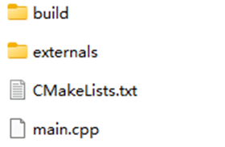
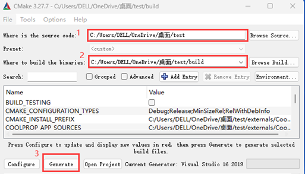
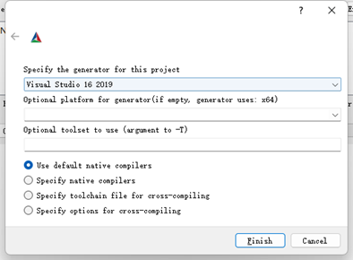
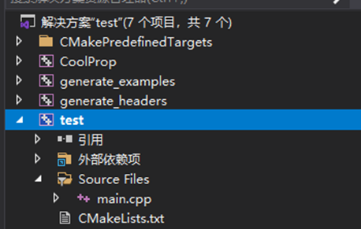

# Coolprop2VS

This doc describes the steps for linking Coolprop package to Visual Studio.

**Test ENV: Visual Studio 2019 Community, Windows 10.**

## Tools

1. Download and install `VS2019 Community`: [Downloads & Keys - Visual Studio Subscriptions](https://my.visualstudio.com/Downloads?q=visual\studio\2019&wt.mc_id=o~msft~vscom~older-downloads)
2. Download `cmake`: [Download CMake](https://cmake.org/download)；[Windows下CMake安装使用_cmake window-CSDN博客](https://blog.csdn.net/finghting321/article/details/105528436)

## CoolProp Setup

```c++
# Check out the sources for CoolProp
git clone https://github.com/CoolProp/CoolProp --recursive  //下载
# Move into the folder you just created
cd CoolProp
# Make a build folder
mkdir -p build && cd build      //创建build子文件夹
# Build the makefile using CMake
cmake .. -DCOOLPROP_STATIC_LIBRARY=ON
# Make the static library
cmake --build .
```

In line 8, the parameters should match IDE, e.g., for VS2019 are:

```c++
cmake .. -A x64 -G "Visual Studio 16 2019" -DCOOLPROP_STATIC_LIBRARY=ON
```
For VS2022, are:

```c++
cmake .. -DCOOLPROP_STATIC_LIBRARY=ON -G "Visual Studio 17 2022" -A x64
```

**TIPS**

If it occurs problem like  *error C1128: 节数超过对象文件格式限制: 请使用 /bigobj 进行编译* when build line 8, you could try to open ` .vcxproj` in `CoolProp/build` and then find the parameters:
```c++
<ItemDefinitionGroup Condition="'$(Configuration)|$(Platform)'=='Debug|x64'">
  <ClCompile>
    <AdditionalOptions>/bigobj %(AdditionalOptions)</AdditionalOptions>
  </ClCompile>
</ItemDefinitionGroup>
```
add ` /bigobj` parameter into it.

Other possible problems：
https://blog.csdn.net/m0_68216188/article/details/147728598

## Link to CoolProp

1. Build a project file, here take the `main file` as an example,

   1. 

   2. ```c++
      main
       |- CMakeLists.txt (For your project, see below)
       |- mycode.cpp
       |- externals
          |- CoolProp
              |- src
              |- include
              |- ...
              |- CMakeLists.txt
              |-
      ```

      - Add the following lines to `CmakeLists.txt`:

      - ```c++
        # See also http://stackoverflow.com/a/18697099
        cmake_minimum_required (VERSION 2.8.11)
        project (main)
        set(COOLPROP_STATIC_LIBRARY true)
        add_subdirectory ("${CMAKE_SOURCE_DIR}/externals/CoolProp" CoolProp)
        add_executable (main "${CMAKE_SOURCE_DIR}/mycode.cpp")
        target_link_libraries (main CoolProp)
        ```

      - Utilize `cmake-gui` to realize the link between Coolprop and VS2019:

      - 

      - 

DONE.


# WAY2
*This tutorial is directly compile CoolProp in Visual Studio through .dll, .lib, and .h.*

**NOTE:** ENVs are Windows 11 and Visual Studio 2022 Community.
1. Build a project in VS2022.
2. Make a file (x64 or x86 which depends on you) in the root directory.
3. 
4. Download `CoolProp.dll、CoolProp.lib、CoolPropLib.h`, note that it is 32 bit or 64 bit. https://sourceforge.net/projects/coolprop/files/CoolProp/7.2.0/shared_library/
5. Put these denpendencies into x64 or x86 file that you made in step 2.
6. Add the include directory (e.g. `E:\coolproptest\Project1\x64` in my case in step 2) of CoolProp to the list of include directories the `C/C++->General` tab in visual studio.
7. Add the directory where the .lib file is (e.g. `E:\coolproptest\Project1\x64` in my case in step 2) to the list of library directories in the `Linker->General` tab of the properties.
8. Add `CoolProp.lib` to the list of .lib files in the `Linker->Input` tab in visual studio.

Finally, build a test case as follows,

```c++
#define EXPORT_CODE extern "C" __declspec(dllimport)
#define CONVENTION __stdcall
#include "CoolPropLib.h"
#undef EXPORT_CODE
#undef CONVENTION
#include <iostream>

int main() {
	std::cout << PropsSI("T", "P", 101325, "Q", 0, "water") << std::endl;
}
```


